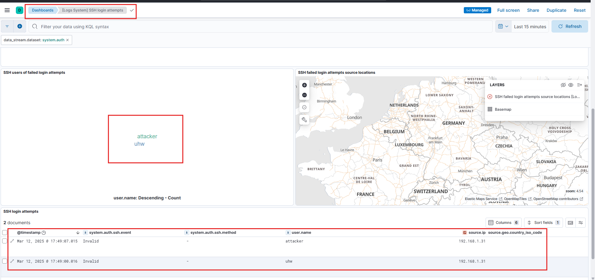

# ELK Stack Installation Guide

This guide provides step-by-step instructions for installing the ELK (Elasticsearch, Logstash, Kibana) Stack on RHEL/CentOS systems. **NOT MEANT FOR PRODUCTION**

## Prerequisites
- RHEL/CentOS-based system
- sudo privileges
- DNF package manager

---

Note: Whenever you enable a service, make sure to open the necessary ports in the firewall to allow proper communication.

---

## 1. Elasticsearch Installation

### 1.1 Import the Elastic GPG Key
```bash
sudo rpm --import https://artifacts.elastic.co/GPG-KEY-elasticsearch
```

### 1.2 Create Elasticsearch Repository
Create `/etc/yum.repos.d/elasticsearch.repo` with the following content:
```ini
[elasticsearch]
name=Elasticsearch repository for 8.x packages
baseurl=https://artifacts.elastic.co/packages/8.x/yum
gpgcheck=1
gpgkey=https://artifacts.elastic.co/GPG-KEY-elasticsearch
enabled=0
autorefresh=1
type=rpm-md
```

### 1.3 Install Elasticsearch
```bash
sudo dnf install --enablerepo=elasticsearch elasticsearch
```

### 1.4 Configure Elasticsearch
For single-node deployment:
1. Edit `/etc/elasticsearch/elasticsearch.yml`
2. Disable `discovery.seed_hosts` and `cluster.initial_master_nodes`
3. Add `discovery.type: single-node`

### 1.5 Start Elasticsearch Service
```bash
sudo systemctl daemon-reload
sudo systemctl enable elasticsearch.service
sudo systemctl start elasticsearch.service
```
---

## 2. Kibana Installation

### 2.1 Create Kibana Repository
Create `/etc/yum.repos.d/kibana.repo` with the following content:
```ini
[kibana-8.x]
name=Kibana repository for 8.x packages
baseurl=https://artifacts.elastic.co/packages/8.x/yum
gpgcheck=1
gpgkey=https://artifacts.elastic.co/GPG-KEY-elasticsearch
enabled=1
autorefresh=1
type=rpm-md
```

### 2.2 Install Kibana
```bash
sudo dnf install kibana
```

### 2.3 Configure Kibana
1. Generate enrollment token:
```bash
/usr/share/elasticsearch/bin/elasticsearch-create-enrollment-token -s kibana
```

2. Enable remote connections by editing `/etc/kibana/kibana.yml`:
```yaml
server.host: "0.0.0.0"
```

### 2.4 Start Kibana Service
```bash
sudo systemctl daemon-reload
sudo systemctl enable kibana.service
sudo systemctl start kibana.service
```
---

## 3. Logstash Installation (For advanced log parsing etc.)

### 3.1 Create Logstash Repository
Create `/etc/yum.repos.d/logstash.repo` with the following content:
```ini
[logstash-8.x]
name=Elastic repository for 8.x packages
baseurl=https://artifacts.elastic.co/packages/8.x/yum
gpgcheck=1
gpgkey=https://artifacts.elastic.co/GPG-KEY-elasticsearch
enabled=1
autorefresh=1
type=rpm-md
```

### 3.2 Install and Start Logstash
```bash
sudo dnf install logstash
sudo systemctl start logstash
```

### 3.3 Configure Logstash
Create a configuration file in `/etc/logstash/conf.d/` with the following content:
```conf
input {
  beats {
    port => 5044
  }
}

output {
  elasticsearch {
    hosts => ["https://192.168.1.31:9200"]
    index => "%{[@metadata][beat]}-%{[@metadata][version]}-%{+YYYY.MM.dd}"
    user => "logstash_system"
    password => "YOUR_PASSWORD"
    ssl_certificate_verification => false
  }
}
```

### 3.4 Configure Logstash Authentication
1. Navigate to Kibana web interface
2. Go to Stack Management → Users
3. Locate the `logstash_system` user
4. Set a new password
5. Update the Logstash configuration with the new credentials

### 3.5 Monitor Logstash Logs
```bash
tail -f /var/log/logstash/*.log
```

## Notes
- Replace `192.168.1.31` with your Elasticsearch host IP
- Always change default passwords for security
- SSL certificate verification is disabled in this example; consider proper SSL setup for production environments

---

## **4. Adding an Agent**
To log system activity directly to Kibana (without Logstash), we use **Fleet Server** to enroll agents and manage them centrally.

### **Steps to Add an Agent:**
1. **Create a Fleet Server** (if not already set up).
2. **Go to "Agent Policies"** in Kibana and **create a new agent policy**.
3. **Select the policy**, then **add an integration**.
   - For Linux logs, add **System Integration** (captures system logs, processes, authentication, sudo commands, etc.).
4. **Go to "Agents" > Click "Add Agent"**.
   - Choose **Enroll in Fleet**.
   - Pick the agent policy you created.
   - Run the given **installation command** on the target machine.
5. **Verify Agent Enrollment**:
   - The agent should now appear as **Healthy** in the Fleet section.

---

## **5. Checking Data in Kibana**
After enrolling an agent, you can **view logs and security events**.

### **Discover Section**
1. **Go to "Discover" in Kibana**.
2. **Select the correct Data View:**  
   - Use **"logs-*"** for general logs.
   - Use **"metrics-*"** for system performance data.
3. **Add Relevant Columns**:
   - `@timestamp` → Time of event
   - `process.name` → Name of executed process
   - `process.command_line` → Full command executed
   - `user.name` → User running the command
   - `source.ip` → IP of login attempts
   - `system.auth.sudo.command` → Logs of sudo commands

💡 **Example Output:**
- Here is an example of **some relevant logs (sudo commands, SSH-login attempts)**:
  

---

### **Dashboards for Visualization**
For better insights, you can **create dashboards** or use built-in ones.

1. **Go to "Dashboards" in Kibana**.
2. **Search for pre-built dashboards**, or create a custom one.
3. **Example: Failed SSH Login Attempts**
   - Shows attackers attempting to access the system.
   - Uses `system.auth.ssh.event` logs to track failed logins.
   - IP sources mapped on **Elastic Maps**.

💡 **Example SSH Attack Dashboard:**
  

